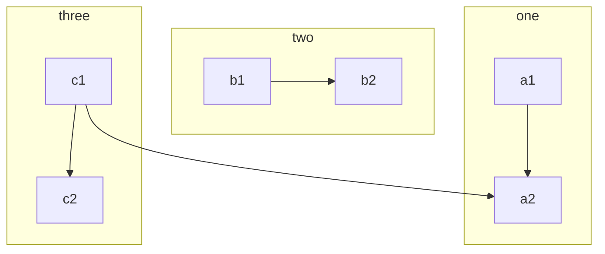

# StructuredProgramming(SPARKS)

- 알고리즘을 기술할 목적으로 만들어진 언어 중 하나가 SPARKS(Structured Programming: A Reasonably Kimplete Set)
- 구성
```
- 선언문
- 지정문
- 조건문
- 반복문
- Procedure문
- 프로시져 사이 자료 전달 방법(process transaction)
- 입출력문
- 주석문
```

- https://en.wikipedia.org/wiki/Flow-based_programming

- https://web.archive.org/web/20180308114549/http://www.hit.ac.il:80/staff/leonidM/information-systems/ch63.html

- https://en.wikipedia.org/wiki/Structured_programming

- http://users.csc.calpoly.edu/~jdalbey/103/Lectures/StructuredProgramming/

<hr>

# mermaid로 flowchart 만들기


https://mermaid.js.org/syntax/flowchart.html


```
flowchart TD
    A[Start] --> B{Is it?}
    B -->|Yes| C[OK]
    C --> D[Rethink]
    D --> B
    B ---->|No| E[End]
```


# Canonical "batch update"structure



https://en.wikipedia.org/wiki/Flow-based_programming

<hr>
