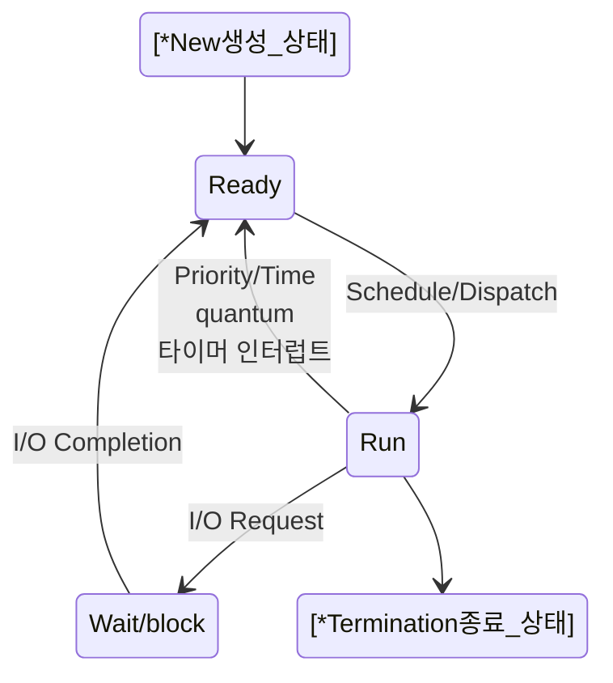

# Kernel 공부하기 

https://git.kernel.org/

# strace 를 이용해서 명령어에 의한 시스템 콜들을 추적

https://access.redhat.com/ko/articles/3118571

# 리눅스 시스템콜 공부(시스템 프로그래밍)

https://man7.org/linux/man-pages/man2/_syscall.2.html

# Process status

https://enlqn1010.tistory.com/30



```
stateDiagram-v2
    [*New생성_상태] --> Ready
    Ready --> Run : Schedule/Dispatch
    Run --> Ready : Priority/Time<br>quantum<br>타이머 인터럽트
    Run --> Wait/block : I/O Request
    Wait/block --> Ready : I/O Completion
    Run --> [*Termination종료_상태]
```
- https://mermaid.live/edit
