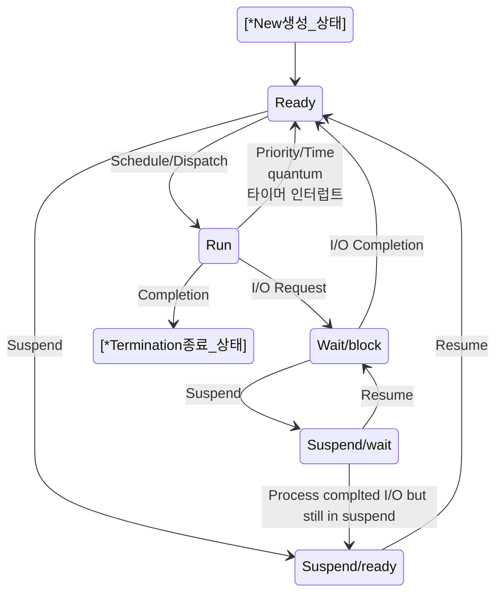
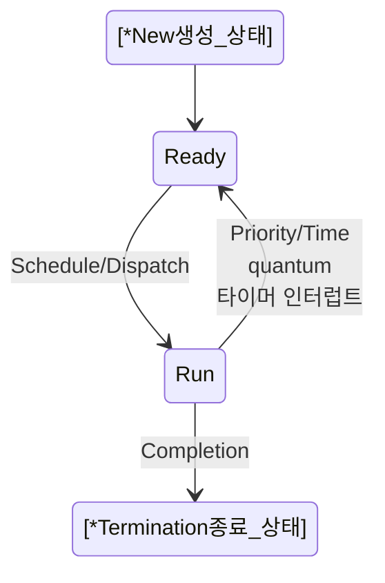
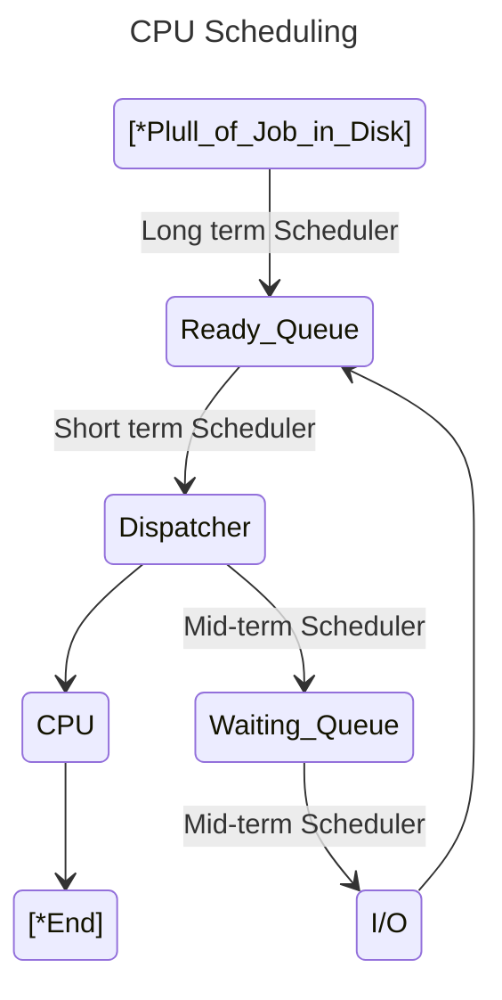

# Kernel 공부하기 

https://git.kernel.org/

# strace 를 이용해서 명령어에 의한 시스템 콜들을 추적

https://access.redhat.com/ko/articles/3118571

# 리눅스 시스템콜 공부(시스템 프로그래밍)

https://man7.org/linux/man-pages/man2/_syscall.2.html

# Process status

https://enlqn1010.tistory.com/30



```
stateDiagram-v2
    [*New생성_상태] --> Ready
    Ready --> Run : Schedule/Dispatch
    Run --> Ready : Priority/Time<br>quantum<br>타이머 인터럽트
    Ready --> Suspend/ready : Suspend
    Suspend/ready --> Ready : Resume
    Run --> Wait/block : I/O Request
    Wait/block --> Ready : I/O Completion
    Wait/block --> Suspend/wait : Suspend
    Suspend/wait --> Wait/block: Resume
    Suspend/wait --> Suspend/ready : Process complted I/O but still in suspend
    Run --> [*Termination종료_상태] : Completion
```

- 큰 흐름



- https://mermaid.live/edit

# CPU Scheduling Algorithms 

- https://www.cs.uic.edu/~jbell/CourseNotes/OperatingSystems/6_CPU_Scheduling.html
- https://eun-jeong.tistory.com/17



```
---
title: CPU Scheduling
---
stateDiagram-v2
    [*Plull_of_Job_in_Disk] --> Ready_Queue : Long term Scheduler
    Ready_Queue --> Dispatcher : Short term Scheduler
    Dispatcher --> CPU
    Dispatcher --> Waiting_Queue : Mid-term Scheduler
    Waiting_Queue --> I/O : Mid-term Scheduler
    I/O --> Ready_Queue
    CPU --> [*End]
```

<br>

<hr>
