# link

- paging
  - [understanding mmap, the workhorse behind keeping memory access efficient in linux | Chris Kanich](#understanding-mmap-the-workhorse-behind-keeping-memory-access-efficient-in-linux--chris-kanich) 

- Memory
  - [Introduction to Memory Management in Linux | The Linux Foundation](#introduction-to-memory-management-in-linux--the-linux-foundation)

- [Unix system calls (1/2) | Brian Will](#unix-system-calls-12--brian-will)

<hr>

- Hardware Basics
  - [Hardware Basics | Brian Will]()

<hr>

# 전체적인 큰틀잡기(System Design Concepts Course and Interview Prep | freeCodeCamp.org)
- https://youtu.be/F2FmTdLtb_4?si=5V0XvqbTPS8gQDKj

<hr>

# Kernel 공부하기 

https://git.kernel.org/

# strace 를 이용해서 명령어에 의한 시스템 콜들을 추적

https://access.redhat.com/ko/articles/3118571

# 리눅스 시스템콜 공부(시스템 프로그래밍)

https://man7.org/linux/man-pages/man2/_syscall.2.html

# Process status

<hr>

- Batch Job(시스템 상태)
  - [상태]
    - Create
    - Run
    - Terminate
- 시분할 시스템 상태(time-sharing)
  - [상태]
    - Active State
      - Create(생성)
      - Readying(준비)
      - Running(실행)
      - Waiting(대기)
      - Terminating(종료)

      ---------------------------------------------
    - Inactive State
      - Pause State(휴식)
      - Suspend State(보류)

- [time-sharing](https://ko.wikipedia.org/wiki/%EC%8B%9C%EB%B6%84%ED%95%A0_%EC%8B%9C%EC%8A%A4%ED%85%9C)

<hr>

<p align="center">
    
</p>


- https://www.javatpoint.com/os-process-states


https://enlqn1010.tistory.com/30

```mermaid
stateDiagram-v2
    [*New생성_상태] --> Ready
    Ready --> Run : Schedule/Dispatch
    Run --> Ready : Priority/Time<br>quantum<br>타이머 인터럽트
    Ready --> Suspend/ready : Suspend
    Suspend/ready --> Ready : Resume
    Run --> Wait/block : I/O Request
    Wait/block --> Ready : I/O Completion
    Wait/block --> Suspend/wait : Suspend
    Suspend/wait --> Wait/block: Resume
    Suspend/wait --> Suspend/ready : Process complted I/O but still in suspend
    Run --> [*Termination종료_상태] : Completion

```



```
stateDiagram-v2
    [*New생성_상태] --> Ready
    Ready --> Run : Schedule/Dispatch
    Run --> Ready : Priority/Time<br>quantum<br>타이머 인터럽트
    Ready --> Suspend/ready : Suspend
    Suspend/ready --> Ready : Resume
    Run --> Wait/block : I/O Request
    Wait/block --> Ready : I/O Completion
    Wait/block --> Suspend/wait : Suspend
    Suspend/wait --> Wait/block: Resume
    Suspend/wait --> Suspend/ready : Process complted I/O but still in suspend
    Run --> [*Termination종료_상태] : Completion
```

- 큰 흐름

```mermaid
stateDiagram-v2
    [*New생성_상태] --> Ready
    Ready --> Run : Schedule/Dispatch
    Run --> Ready : Priority/Time<br>quantum<br>타이머 인터럽트
    Run --> [*Termination종료_상태] : Completion
```



- https://mermaid.live/edit

# CPU Scheduling Algorithms 

- https://www.cs.uic.edu/~jbell/CourseNotes/OperatingSystems/6_CPU_Scheduling.html
- https://eun-jeong.tistory.com/17


```
---
title: CPU Scheduling
---
stateDiagram-v2
    [*Plull_of_Job_in_Disk] --> Ready_Queue : Long term Scheduler
    Ready_Queue --> Dispatcher : Short term Scheduler
    Dispatcher --> CPU
    Dispatcher --> Waiting_Queue : Mid-term Scheduler
    Waiting_Queue --> I/O : Mid-term Scheduler
    I/O --> Ready_Queue
    CPU --> [*End]
```

<br>

<hr>

- CPU Scheduling(Preemptive  VS. Non-Preemptive)
  - Preemptive scheduling (If job does not block or exit, force an involuntary context switch after each quantum Q of CPU time)
    - https://www.cs.princeton.edu/courses/archive/fall11/cos318/lectures/L7_CPUScheduling.pdf
  - Non-Preemptive scheduling

- https://www.cs.princeton.edu/courses/archive/fall21/cos318/lectures/8.CPUScheduling.pdf

- Preemptive vs Non-Preemptive Cons Pros.
  - https://www.guru99.com/preemptive-vs-non-preemptive-scheduling.html

<table>
<thead>
<tr>
<th width="50%">Preemptive Scheduling</th>
<th>Non-preemptive Scheduling</th>
</tr>
</thead>
<tbody>
<tr>
<td>A processor can be preempted to execute the different processes in the middle of any current process execution.</td>
<td>Once the processor starts its execution, it must finish it before executing the other. It can’t be paused in the middle.</td>
</tr>
<tr>
<td>CPU utilization is more efficient compared to Non-Preemptive Scheduling.</td>
<td>CPU utilization is less efficient compared to preemptive Scheduling.</td>
</tr>
<tr>
<td>Waiting and response time of preemptive Scheduling is less.</td>
<td>Waiting and response time of the non-preemptive Scheduling method is higher.</td>
</tr>
<tr>
<td>Preemptive Scheduling is prioritized. The highest priority process is a process that is currently utilized.</td>
<td>When any process enters the state of running, the state of that process is never deleted from the scheduler until it finishes its job.</td>
</tr>
<tr>
<td>Preemptive Scheduling is flexible.</td>
<td>Non-preemptive Scheduling is rigid.</td>
</tr>
<tr>
<td>Examples: – Shortest Remaining Time First, Round Robin, etc.</td>
<td>Examples: <a href="/fcfs-scheduling.html" data-lasso-id="496827">First Come First Serve</a>, Shortest Job First, Priority Scheduling, etc.</td>
</tr>
<tr>
<td>Preemptive Scheduling algorithm can be pre-empted that is the process can be Scheduled</td>
<td>In non-preemptive scheduling process cannot be Scheduled</td>
</tr>
<tr>
<td><em><strong>In this process, the CPU is allocated to the processes for a specific time period.</strong></em></td>
<td>In this process, CPU is allocated to the process<em><strong> until it terminates or switches to the waiting state.</strong></em></td>
</tr>
<tr>
<td>Preemptive algorithm has the <em><strong>overhead of switching the process</strong></em> from the ready state to the running state and vice-versa.</td>
<td>Non-preemptive Scheduling has<em><strong> no such overhead of switching the process</strong></em> from running into the ready state.</td>
</tr>
</tbody>
</table>

<br>

<hr>

# 스와핑(Swapping)
- 스와핑(swapping)
  - 프로세스를 보조기억장치의 일부 영역으로 쫓아내고 당장 필요한 프로세스를 적재하는 메모리 관리 기법
- 스왑 아웃(swap-out)
  - 프로세스를 보조기억장치의 일부 영역으로 쫓아내는 것
- 스왑 인(swap-in)
  - 스왑 아웃된 프로세스를 메모리에 적재하는 것
- 스왑 영역
  - 스왑 아웃된 프로세스가 적재되는 보조기억장치 영역

<hr>

# 단편화(Fragmentation)

https://ko.wikipedia.org/wiki/%EB%8B%A8%ED%8E%B8%ED%99%94

# 외부단편화(External Fragmentation)
https://byjus.com/gate/external-fragmentation-in-os-notes/

# Difference between Internal and External fragmentation

https://www.geeksforgeeks.org/difference-between-internal-and-external-fragmentation/

# Page Table
https://en.wikipedia.org/wiki/Page_table

# Paging의 모든 정보 정리됨
https://courses.engr.illinois.edu/cs241/su2012/lecture/1112-memory-finale.pdf

# PTBR
- PTBR(Page Table Base Register)이란 대체 무엇인가?
  - https://m.blog.naver.com/PostView.naver?blogId=qkreorb0321&logNo=110178037547&categoryNo=33&proxyReferer=
    -  https://www.answers.com/performing-arts-ec/What_is_a_page_table_base_register

- How page table base register (PTBR) is used to locate the correct frame using Page Number?
  - https://stackoverflow.com/questions/66180810/how-page-table-base-register-ptbr-is-used-to-locate-the-correct-frame-using-pa


# Valid Bit

- [운영체제] TLB valid bit vs. Page Table valid bit
  - https://m.blog.naver.com/xofyd99/221835811942

- Valid Bit and Dirty Bit in page tables
  - https://stackoverflow.com/questions/66979977/valid-bit-and-dirty-bit-in-page-tables

## Page Fault 

https://en.wikipedia.org/wiki/Page_fault

## Protection Bit
- 자료가 많다. 굿 https://movahws.tistory.com/149 

## Reference Bit
- https://courses.engr.illinois.edu/cs241/su2012/lecture/1112-memory-finale.pdf

## Modify Bit & Dirty Bit
- Dirty Bit
  - https://en.wikipedia.org/wiki/Dirty_bit

<hr>

# Thrashing(스레싱)

- https://en.wikipedia.org/wiki/Thrashing_(computer_science)

- https://jwprogramming.tistory.com/56


- https://zangzangs.tistory.com/144

<hr>

# understanding mmap, the workhorse behind keeping memory access efficient in linux | Chris Kanich[|🔝|](#link)
- https://youtu.be/8hVLcyBkSXY?si=58j8xcsTYLeIcFhw


<hr>

# Memory

# Introduction to Memory Management in Linux | The Linux Foundation[|🔝|](#link)
- https://youtu.be/7aONIVSXiJ8?si=vrOXOYZ4R1MZAqpS

<hr>

# Unix system calls (1/2) | Brian Will[|🔝|](#link)
- https://youtu.be/xHu7qI1gDPA?si=LeFegKQ2dah6m5gJ

<hr>

# Hardware Basics | Brian Will[|🔝|](#link)
- https://youtu.be/9-KUm9YpPm0?si=f0qUhAp5wo4RmCDg
