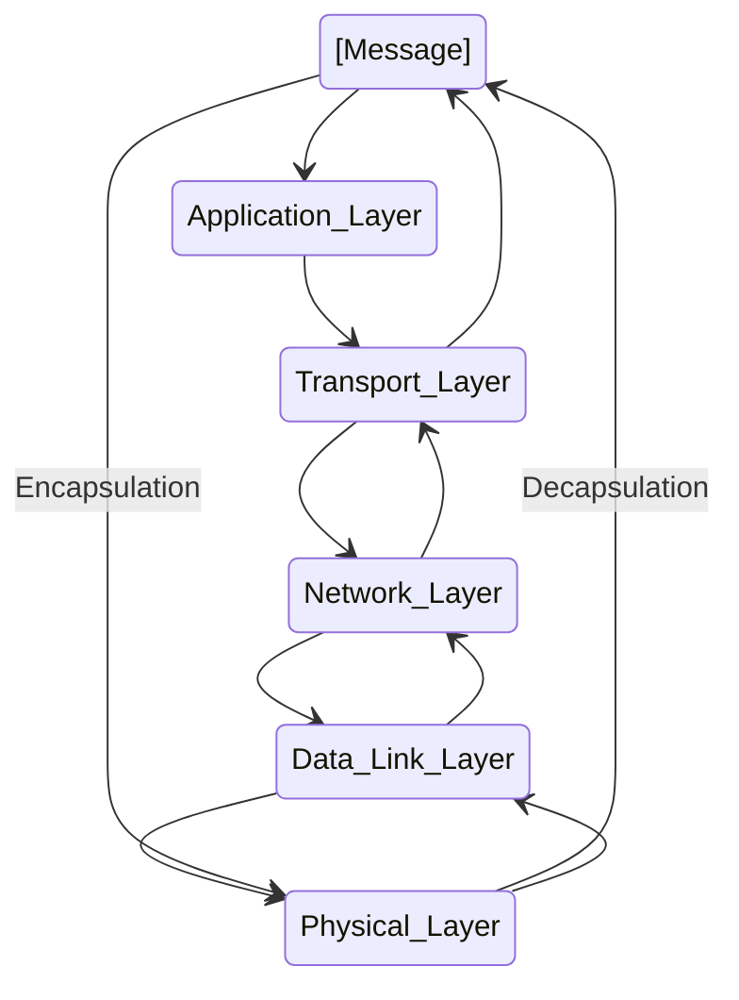

# Blocking vs Non-Blocking & Sync vs Async  

- Poll 개념도 나온다. 굿 

https://velog.io/@tjdgus3160/Blocking-vs-Non-Blocking-Sync-vs-Async

<hr>

# c#: what is a thread polling?

- https://stackoverflow.com/questions/3849697/c-what-is-a-thread-polling

# UDP Header


- 자세히 https://joycecoder.tistory.com/20

# TCP Header


http://www.ktword.co.kr/test/view/view.php?m_temp1=1889

<hr>

# OSI Model
https://www.geeksforgeeks.org/difference-between-osi-model-and-tcp-ip-model/


- 물리 계층(Physical Layer)
- 데이터링크 계층(Data Link Layer)
- 네트워크 계층(Network Layer)
- 전송 계층(Transport Layer)
- 세션 계층(Session Layer)
- 표현 계층(Presentation Layer)
- 응용 계층(Application Layer)

# TCP/IP Model
https://www.geeksforgeeks.org/difference-between-osi-model-and-tcp-ip-model/


# 캡슐화(Encapsulation (computer programming)) & Encapsulation_(networking)

https://en.wikipedia.org/wiki/Encapsulation_(networking)




```
- 응용 계층
- 전송 계층
- 네트워크 계층
- 데이터 링크 계층
- 물리 계층
```

- https://en.wikipedia.org/wiki/Encapsulation_(computer_programming)


# What is the OSI model?

- The Open Systems Interconnection (OSI) Model is a description of how the Internet works. It breaks down the functions involved in sending data over the Internet into seven layers. Each layer has some function that prepares the data to be sent over wires, cables, and radio waves as a series of bits.

- The seven layers of the OSI model are:

  7. ```Application layer```: <br>Data generated by and usable by software applications. The main protocol used at this layer is <em><strong>HTTP.</em></strong><br>
  6. ```Presentation layer```: <br>Data is translated into a form the application can accept. Some authorities consider HTTPS encryption and decryption to take place at this layer.<br>
  5. ```Session layer```: <br>Controls connections between computers (this can also be handled at layer 4 by the TCP protocol).<br>
  4. ```Transport layer```: <br>Provides the means for transmitting data between the two connected parties, as well as controlling the quality of service. The main protocols used here are <em><strong>TCP and UDP.</em></strong><br>
  3. ```Network layer```: <br>Handles the routing and sending of data between different networks. The most important protocols at this layer are <em><strong>IP and ICMP.</em></strong><br>
  2. ```Data link layer```: <br>Handles communications between devices on the same network. If layer 3 is like the address on a piece of mail, then layer 2 is like indicating the office number or apartment number at that address. Ethernet is the protocol most used here.<br>
  1. ```Physical layer```:<br>Packets are converted into electrical, radio, or optical pulses and transmitted as bits (the smallest possible units of information) over wires, radio waves, or cables.<br>

https://www.cloudflare.com/learning/network-layer/what-is-the-network-layer/

# OSI계층 & PDU

| OSI계층 | PDU(Protocol Data Unit) |
|-|-|
| 응용 계층<br>표현 계층<br>세션 계층 | 데이터(data) |
| 전송 계층  | 세그먼트(Segment), 데이터그램(datagram) | 
| 네트워크 계층  | 패킷(packet) | 
| 데이터 링크 계층  | 프레임(frame) | 
| 물리 계층  | 비트(bit) | 

- OSI model
https://en.wikipedia.org/wiki/Protocol_data_unit
  - Protocol data units of the OSI model are:[1]
    - The Layer 4: ```transport layer``` PDU is the ```segment``` or the ```datagram```.
    - The Layer 3: ```network layer``` PDU is the ```packet```.
    - The Layer 2: ```data link layer``` PDU is the ```frame```.
    - The Layer 1: ```physical layer``` PDU is the ```bit``` or, more generally, ```symbol```.
- Given a context pertaining to a specific OSI layer, PDU is sometimes used as a synonym for its representation at that layer. 

# 이더넷(Ethernet)

https://ko.wikipedia.org/wiki/%EC%9D%B4%EB%8D%94%EB%84%B7
- 이더넷은 48bit?
  - https://blog.naver.com/voice45/80204482928

| 표준 규격<br>(Ethernet<br>Standard) | 전송 속도 | 연결 매체 종류 |
|-|-|-|
|802.3ab|1 Gbit/s| twisted pair at 1 Gbit/s (125 MB/s) |
|802.3u|100 Mbit/s| Fast Ethernet at 100 Mbit/s (12.5 MB/s) with autonegotiation|
|802.3ae|10 Gbit/s|10 Gigabit Ethernet over fiber; |
|802.3cc|25 Gbit/s|25 Gbit/s over Single Mode Fiber |

- https://en.wikipedia.org/wiki/IEEE_802.3

- http://www.ktword.co.kr/test/view/view.php?m_temp1=412

# 이더켓 케이블

- UTP, FTP, STP 케이블 https://blog.naver.com/dlansduq/221007328226

- CAT.5 ~ CAT.7

|Category| 전송속도 | 대역폭 | 규 격 |
|-|-|-|-|
| CAT.5 | 100 Mbps| 100 MHz | 100 Base-TX |
| CAT.5E | 1 Gbps| 100 MHz | 1000 Base-TX |
| CAT.6 | 1 Gbps| 250 MHz | 1000 Base-TX |
| CAT.6A | 10 Gbps| 500 MHz | 10G Base |
| CAT.7 | 10 Gbps| 600 MHz | 10G Base |

- https://m.blog.naver.com/dlansduq/221007341419

- 최근 몇 년 동안 25GBase-T(25G 트위스트 와이어 이더넷) 기술은 높은 포트 밀도와 낮은 전력 소비 및 네트워크 배포 비용으로 인해 클라우드 컴퓨팅 데이터 센터에서 인기있는 기술이 되었습니다. 25GBase-T는 단일 채널에 걸쳐 25Gbps를 제공하고, 더 높은 대역폭 이더넷 업그레이드를 지원하며, 데이터 센터 및 서버룸에 적합합니다. 이 문서에서는 25Gbase-T에 대한 포괄적인 소개를 제공합니다
  - http://ko.oadm-cwdm-dwdm.com/info/what-s-25gbase-t-52190986.html

|추가 특성 표기(전송매체의 종류)| 의미 |
|-|-|
|C| 동축 케이블(Coaxial cable) |
|T| 트위스티드 페어 케이블(Twisted pair) |
|S| 멀티 모드 광케이블(Multi-mode optical fiber) |
|L| 싱글 모드 광케이블(Single-mode optical fiber) |

- Coaxial cable https://en.wikipedia.org/wiki/Coaxial_cable
- Twisted pair https://en.wikipedia.org/wiki/Twisted_pair
- Multi-mode optical fiber https://en.wikipedia.org/wiki/Multi-mode_optical_fiber
- Single-mode optical fiber https://en.wikipedia.org/wiki/Single-mode_optical_fiber
