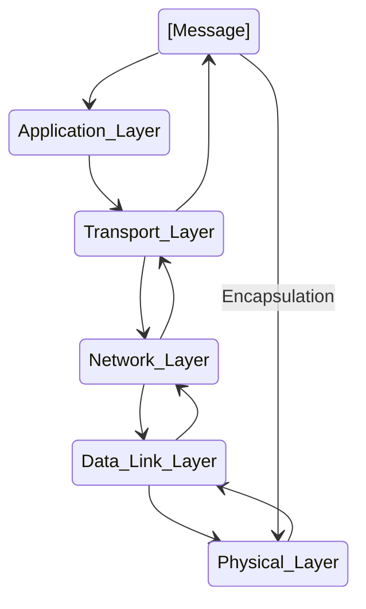

# Blocking vs Non-Blocking & Sync vs Async  

- Poll 개념도 나온다. 굿 

https://velog.io/@tjdgus3160/Blocking-vs-Non-Blocking-Sync-vs-Async

<hr>

# c#: what is a thread polling?

- https://stackoverflow.com/questions/3849697/c-what-is-a-thread-polling

# UDP Header


- 자세히 https://joycecoder.tistory.com/20

# TCP Header


http://www.ktword.co.kr/test/view/view.php?m_temp1=1889

<hr>

# OSI Model
https://www.geeksforgeeks.org/difference-between-osi-model-and-tcp-ip-model/


- 물리 계층(Physical Layer)
- 데이터링크 계층(Data Link Layer)
- 네트워크 계층(Network Layer)
- 전송 계층(Transport Layer)
- 세션 계층(Session Layer)
- 표현 계층(Presentation Layer)
- 응용 계층(Application Layer)

# TCP/IP Model
https://www.geeksforgeeks.org/difference-between-osi-model-and-tcp-ip-model/


# 캡슐화(Encapsulation (computer programming)) & Encapsulation_(networking)

https://en.wikipedia.org/wiki/Encapsulation_(networking)




```
- 응용 계층
- 전송 계층
- 네트워크 계층
- 데이터 링크 계층
- 물리 계층
```

- https://en.wikipedia.org/wiki/Encapsulation_(computer_programming)


# What is the OSI model?

- The Open Systems Interconnection (OSI) Model is a description of how the Internet works. It breaks down the functions involved in sending data over the Internet into seven layers. Each layer has some function that prepares the data to be sent over wires, cables, and radio waves as a series of bits.

- The seven layers of the OSI model are:

  7. Application layer: <br>Data generated by and usable by software applications. The main protocol used at this layer is <em><strong>HTTP.</em></strong><br>
  6. Presentation layer: <br>Data is translated into a form the application can accept. Some authorities consider HTTPS encryption and decryption to take place at this layer.<br>
  5. Session layer: <br>Controls connections between computers (this can also be handled at layer 4 by the TCP protocol).<br>
  4. Transport layer: <br>Provides the means for transmitting data between the two connected parties, as well as controlling the quality of service. The main protocols used here are <em><strong>TCP and UDP.</em></strong><br>
  3. Network layer: <br>Handles the routing and sending of data between different networks. The most important protocols at this layer are <em><strong>IP and ICMP.</em></strong><br>
  2. Data link layer: <br>Handles communications between devices on the same network. If layer 3 is like the address on a piece of mail, then layer 2 is like indicating the office number or apartment number at that address. Ethernet is the protocol most used here.<br>
  1. Physical layer:<br>Packets are converted into electrical, radio, or optical pulses and transmitted as bits (the smallest possible units of information) over wires, radio waves, or cables.<br>

https://www.cloudflare.com/learning/network-layer/what-is-the-network-layer/

