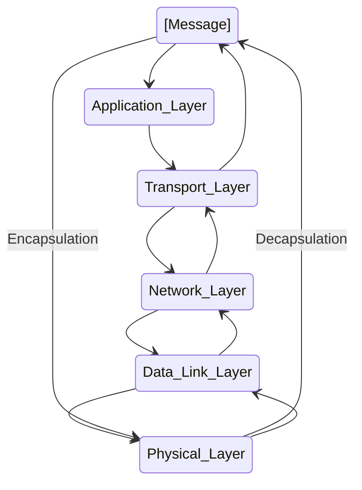

# Blocking vs Non-Blocking & Sync vs Async  

- Poll 개념도 나온다. 굿 

https://velog.io/@tjdgus3160/Blocking-vs-Non-Blocking-Sync-vs-Async

<hr>

# c#: what is a thread polling?

- https://stackoverflow.com/questions/3849697/c-what-is-a-thread-polling

# UDP Header


- 자세히 https://joycecoder.tistory.com/20

# TCP Header


http://www.ktword.co.kr/test/view/view.php?m_temp1=1889

<hr>

# OSI Model
https://www.geeksforgeeks.org/difference-between-osi-model-and-tcp-ip-model/


- 물리 계층(Physical Layer)
- 데이터링크 계층(Data Link Layer)
- 네트워크 계층(Network Layer)
- 전송 계층(Transport Layer)
- 세션 계층(Session Layer)
- 표현 계층(Presentation Layer)
- 응용 계층(Application Layer)

# TCP/IP Model
https://www.geeksforgeeks.org/difference-between-osi-model-and-tcp-ip-model/


# 캡슐화(Encapsulation (computer programming)) & Encapsulation_(networking)

https://en.wikipedia.org/wiki/Encapsulation_(networking)




```
- 응용 계층
- 전송 계층
- 네트워크 계층 -> IP , Routing , ICMP
- 데이터 링크 계층 -> 스위치Switch
- 물리 계층 -> 허브Hub
```

- https://en.wikipedia.org/wiki/Encapsulation_(computer_programming)

- https://en.wikipedia.org/wiki/IP_routing

# What is the OSI model?

- The Open Systems Interconnection (OSI) Model is a description of how the Internet works. It breaks down the functions involved in sending data over the Internet into seven layers. Each layer has some function that prepares the data to be sent over wires, cables, and radio waves as a series of bits.

- The seven layers of the OSI model are:

  7. ```Application layer```: <br>Data generated by and usable by software applications. The main protocol used at this layer is <em><strong>HTTP.</em></strong><br>
  6. ```Presentation layer```: <br>Data is translated into a form the application can accept. Some authorities consider HTTPS encryption and decryption to take place at this layer.<br>
  5. ```Session layer```: <br>Controls connections between computers (this can also be handled at layer 4 by the TCP protocol).<br>
  4. ```Transport layer```: <br>Provides the means for transmitting data between the two connected parties, as well as controlling the quality of service. The main protocols used here are <em><strong>TCP and UDP.</em></strong><br>
  3. ```Network layer```: <br>Handles the routing and sending of data between different networks. The most important protocols at this layer are <em><strong>IP and ICMP.</em></strong><br>
  2. ```Data link layer```: <br>Handles communications between devices on the same network. If layer 3 is like the address on a piece of mail, then layer 2 is like indicating the office number or apartment number at that address. Ethernet is the protocol most used here.<br>
  1. ```Physical layer```:<br>Packets are converted into electrical, radio, or optical pulses and transmitted as bits (the smallest possible units of information) over wires, radio waves, or cables.<br>

https://www.cloudflare.com/learning/network-layer/what-is-the-network-layer/

# OSI계층 & PDU

| OSI계층 | PDU(Protocol Data Unit) |
|-|-|
| 응용 계층<br>표현 계층<br>세션 계층 | 데이터(data) |
| 전송 계층  | 세그먼트(Segment), 데이터그램(datagram) | 
| 네트워크 계층  | 패킷(packet) | 
| 데이터 링크 계층  | 프레임(frame) | 
| 물리 계층  | 비트(bit) | 

- OSI model
https://en.wikipedia.org/wiki/Protocol_data_unit
  - Protocol data units of the OSI model are:[1]
    - The Layer 4: ```transport layer``` PDU is the ```segment``` or the ```datagram```.
    - The Layer 3: ```network layer``` PDU is the ```packet```.
    - The Layer 2: ```data link layer``` PDU is the ```frame```.
    - The Layer 1: ```physical layer``` PDU is the ```bit``` or, more generally, ```symbol```.
- Given a context pertaining to a specific OSI layer, PDU is sometimes used as a synonym for its representation at that layer. 

# 이더넷(Ethernet)

https://ko.wikipedia.org/wiki/%EC%9D%B4%EB%8D%94%EB%84%B7
- 이더넷은 48bit?
  - https://blog.naver.com/voice45/80204482928

| 표준 규격<br>(Ethernet<br>Standard) | 전송 속도 | 연결 매체 종류 |
|-|-|-|
|802.3ab|1 Gbit/s| twisted pair at 1 Gbit/s (125 MB/s) |
|802.3u|100 Mbit/s| Fast Ethernet at 100 Mbit/s (12.5 MB/s) with autonegotiation|
|802.3ae|10 Gbit/s|10 Gigabit Ethernet over fiber; |
|802.3cc|25 Gbit/s|25 Gbit/s over Single Mode Fiber |

- https://en.wikipedia.org/wiki/IEEE_802.3

- http://www.ktword.co.kr/test/view/view.php?m_temp1=412

# 이더켓 케이블

- UTP, FTP, STP 케이블 https://blog.naver.com/dlansduq/221007328226

- CAT.5 ~ CAT.7

|Category| 전송속도 | 대역폭 | 규 격 |
|-|-|-|-|
| CAT.5 | 100 Mbps| 100 MHz | 100 Base-TX |
| CAT.5E | 1 Gbps| 100 MHz | 1000 Base-TX |
| CAT.6 | 1 Gbps| 250 MHz | 1000 Base-TX |
| CAT.6A | 10 Gbps| 500 MHz | 10G Base |
| CAT.7 | 10 Gbps| 600 MHz | 10G Base |

- https://m.blog.naver.com/dlansduq/221007341419

- 최근 몇 년 동안 25GBase-T(25G 트위스트 와이어 이더넷) 기술은 높은 포트 밀도와 낮은 전력 소비 및 네트워크 배포 비용으로 인해 클라우드 컴퓨팅 데이터 센터에서 인기있는 기술이 되었습니다. 25GBase-T는 단일 채널에 걸쳐 25Gbps를 제공하고, 더 높은 대역폭 이더넷 업그레이드를 지원하며, 데이터 센터 및 서버룸에 적합합니다. 이 문서에서는 25Gbase-T에 대한 포괄적인 소개를 제공합니다
  - http://ko.oadm-cwdm-dwdm.com/info/what-s-25gbase-t-52190986.html

|추가 특성 표기<br>(전송매체의 종류)| 의미 |
|-|-|
|C| 동축 케이블(Coaxial cable) |
|T| 트위스티드 페어 케이블(Twisted pair) |
|S| 멀티 모드 광케이블(Multi-mode optical fiber) |
|L| 싱글 모드 광케이블(Single-mode optical fiber) |

- Coaxial cable https://en.wikipedia.org/wiki/Coaxial_cable
- Twisted pair https://en.wikipedia.org/wiki/Twisted_pair
- Multi-mode optical fiber https://en.wikipedia.org/wiki/Multi-mode_optical_fiber
- Single-mode optical fiber https://en.wikipedia.org/wiki/Single-mode_optical_fiber

# Ethernet frame

https://en.wikipedia.org/wiki/Ethernet_frame

<table>
<caption>802.3 Ethernet packet and frame structure
</caption>
<tbody><tr>
<th>Layer</th>
<th>Preamble</th>
<th>Start frame delimiter (SFD)</th>
<th>MAC destination</th>
<th>MAC source</th>
<th><a href="/wiki/802.1Q" class="mw-redirect" title="802.1Q">802.1Q</a> tag (optional)</th>
<th><a href="/wiki/Ethertype" class="mw-redirect" title="Ethertype">Ethertype</a> (<a href="/wiki/Ethernet_II" class="mw-redirect" title="Ethernet II">Ethernet&nbsp;II</a>) or&nbsp;length (<a href="/wiki/IEEE_802.3" title="IEEE 802.3">IEEE&nbsp;802.3</a>)</th>
<th>Payload</th>
<th><a href="/wiki/Frame_check_sequence" title="Frame check sequence">Frame check sequence</a> (32‑bit <a href="/wiki/Cyclic_redundancy_check" title="Cyclic redundancy check">CRC</a>)</th>
<th><a href="/wiki/Interpacket_gap" title="Interpacket gap">Interpacket&nbsp;gap (IPG)</a>
</th></tr>
<tr>
<td>
</td>
<td>7 <a href="/wiki/Octet_(computing)" title="Octet (computing)">octets</a></td>
<td>1 octet</td>
<td>6 octets</td>
<td>6&nbsp;octets</td>
<td>(4 octets)</td>
<td>2 octets</td>
<td>46-1500 octets</td>
<td><span class="nowrap">4 octets</span></td>
<td>12 octets
</td></tr>
<tr>
<td><a href="/wiki/Data_link_layer" title="Data link layer">Layer 2</a> Ethernet frame
</td>
<td colspan="2">(not part of the frame)</td>
<td colspan="6" style="background:#fdd;"><span class="nowrap">← 64–1522 octets →</span></td>
<td>(not part of the frame)
</td></tr>
<tr>
<td><a href="/wiki/Physical_layer" title="Physical layer">Layer 1</a> Ethernet packet &amp; IPG
</td>
<td colspan="8" style="background:#fdd;"><span class="nowrap">← 72–1530 octets →</span></td>
<td style="background:#fdd;">← 12 octets&nbsp;→
</td></tr></tbody>
</table>


- 이더넷 프레임 : 이더넷 네트워크에서 주고 받는 데이터 형식

<table border="1">
    <tr>
    <td colspan="6" align="center">Ethernet frame</td>
    </tr>
    <tr align="center">
        <td colspan="4" align="center">←----------- 헤더 -----------→</td>
        <td>←-- 페이로드 --→</td>
        <td>← 트레일러 →</td>
    </tr>
    <tr align="center">
        <td>프리앰블</td>
        <td>목적지 MAC<br>주소</td>
        <td>송신지 MAC<br>주소</td>
        <td>이더타입/<br>길이</td>
        <td>데이터</td>
        <td>FCS</td>
    </tr>
    <tr align="center">
        <td>8 바이트</td>
        <td>6 바이트</td>
        <td>6 바이트</td>
        <td>2 바이트</td>
        <td>46 ~ 1500 바이트</td>
        <td>4 바이트</td>
    </tr>
  
</table>

  - 이더넷 프레임
    - https://www.iana.org/assignments/ieee-802-numbers/ieee-802-numbers.xhtml
<table border="1">
    <tr>
    <td colspan="6" align="center">Ethernet frame</td>
    </tr>
    <tr align="center">
        <td>Ethertype<br>(decimal)</td>
        <td>Ethertype<br>(hex)</td>
        <td>Exp.<br>Ethernet<br>(decimal)</td>
        <td>Exp.<br>Ethernet<br>(octal)</td>
        <td>Description</td>
        <td>Reference</td>
    </tr>
        <tr align="center">
        <td>2048</td>
        <td>0800</td>
        <td>513</td>
        <td>1001</td>
        <td>Internet Protocol version 4 (IPv4)</td>
        <td>[<a href="https://datatracker.ietf.org/doc/draft-ietf-intarea-rfc7042bis/11/">RFC-ietf-intarea-rfc7042bis-11</a>]</td>
    </tr>
        </tr>
        <tr align="center">
        <td>34525</td>
        <td>86DD</td>
        <td></td>
        <td></td>
        <td>Internet Protocol version 6 (IPv6)</td>
        <td>[<a href="https://datatracker.ietf.org/doc/draft-ietf-intarea-rfc7042bis/11/">RFC-ietf-intarea-rfc7042bis-11</a>]</td>
    </tr>
        </tr>
        <tr align="center">
        <td>2054</td>
        <td>0806</td>
        <td></td>
        <td></td>
        <td>Address Resolution Protocol (ARP)</td>
        <td>[<a href="https://datatracker.ietf.org/doc/draft-ietf-intarea-rfc7042bis/11/">RFC-ietf-intarea-rfc7042bis-11</a>]</td>
    </tr>
        </tr>
        <tr align="center">
        <td></td>
        <td></td>
        <td></td>
        <td></td>
        <td></td>
        <td></td>
    </tr>
</table>

- 출처 : https://www.iana.org/assignments/ieee-802-numbers/ieee-802-numbers.xhtml
  - Full Duplex & Half Duplex
    - https://en.wikipedia.org/wiki/Duplex_(telecommunications)

<hr>

<hr>

# Hub

```
1. Flooding
2. Forwarding & Filtering
3. Aging
```
- 1. https://en.wikipedia.org/wiki/MAC_flooding
- https://hihighlinux.tistory.com/95

<hr>

- 네트워크 총정리 요약본 CheatSheet http://datamining.rutgers.edu/teaching/spring2010/CNA/lecture16.pdf
  - Network Switch - Concept and Working - Filtering | Flooding | Forwarding | Learning | Hacks and Security - Second Channe
    -  https://youtu.be/Xh6Y_Wto33w?si=oBotzeYev7MYff4w
  - Switching in networking in Hindi | CCNA | Network Kings
    - https://youtu.be/I1McrK2XILk?si=md3UMmakfdzzf5n7


- Network Devices – How Hubs and Switches Work and How to Secure Them
  - https://www.freecodecamp.org/news/how-hub-switch-work-and-how-to-protect-them/
 
- Network Devices (Hub, Repeater, Bridge, Switch, Router, Gateways and Brouter)
  - https://www.geeksforgeeks.org/network-devices-hub-repeater-bridge-switch-router-gateways/

<hr>

# IP

- IP에서 MTU개념 이해(In computer networking, the maximum transmission unit (MTU))
  - Pv4 allows fragmentation which divides the datagram into pieces ...
    - https://en.wikipedia.org/wiki/Maximum_transmission_unit

- ```ifconfig``` macOS에서 test함

```bash
$ ifconfig
lo0: flags=8049<UP,LOOPBACK,RUNNING,MULTICAST> mtu 16384
	options=1203<RXCSUM,TXCSUM,TXSTATUS,SW_TIMESTAMP>
	inet 127.0.0.1 netmask 0xff000000
	inet6 ::1 prefixlen 128
	inet6 fe80::1%lo0 prefixlen 64 scopeid 0x1
	nd6 options=201<PERFORMNUD,DAD>
gif0: flags=8010<POINTOPOINT,MULTICAST> mtu 1280
```

```
1.4 Operation (IP)
The internet protocol implements two basic functions: addressing and fragmentation.
```

https://datatracker.ietf.org/doc/html/rfc791

- IPv4 Header
  - http://www.ktword.co.kr/test/view/view.php?m_temp1=1859
  - https://en.wikipedia.org/wiki/Internet_Protocol_version_4

<hr>

- MAC Address


<table border="1">
    <tr>
    <td colspan="6" align="center">MAC<br>Media Access Control Address</td>
    </tr>
    <tr align="center">
        <td>A1</td>
        <td>B2</td>
        <td>C3</td>
        <td>D4</td>
        <td>E5</td>
        <td>F6</td>
    </tr>
    <tr align="center">
        <td colspan="3">Organizationally<br>Unique Identifier<br>24bits<br>Manufacturer<br>Identification</td>
        <td colspan="3">Universally<br>Administered Address<br>24bits<br>NIC's Unique Number</td>
    </tr>
    <tr align="center">
        <td></td>
        <td></td>
        <td></td>
        <td></td>
        <td></td>
        <td></td>
    </tr>
</table>

- 출처 : https://www.baeldung.com/cs/understanding-mac-addresses


- 출처 : https://developnote-blog.tistory.com/m/entry/MAC-Address

- 24bit + 24bit

- Universal/local and individual/group bits in MAC addresses
<table>
<caption>Universal/local and individual/group bits in MAC addresses
</caption>
<tbody><tr>
<th style="background:#EAECF0;background:linear-gradient(to top right,#EAECF0 49%,#AAA 49.5%,#AAA 50.5%,#EAECF0 51%);line-height:1.2;padding:0.1em 0.4em;"><div style="margin-left:2em;text-align:right">U/L</div><div style="margin-right:2em;text-align:left">I/G</div>
</th>
<th>Universally administered
</th>
<th>Locally administered
</th></tr>
<tr>
<th>Unicast (individual)
</th>
<td><span style="padding-right: 1px;"><span class="macaddr"><i>X<b><u>0</u></b>-XX-XX-XX-XX-XX</i></span></span><br><span style="padding-right: 1px;"><span class="macaddr"><i>X<b><u>4</u></b>-XX-XX-XX-XX-XX</i></span></span><br><span style="padding-right: 1px;"><span class="macaddr"><i>X<b><u>8</u></b>-XX-XX-XX-XX-XX</i></span></span><br><span style="padding-right: 1px;"><span class="macaddr"><i>X<b><u>C</u></b>-XX-XX-XX-XX-XX</i></span></span>
</td>
<td><span style="padding-right: 1px;"><span class="macaddr"><i>X<b><u>2</u></b>-XX-XX-XX-XX-XX</i></span></span><br><span style="padding-right: 1px;"><span class="macaddr"><i>X<b><u>6</u></b>-XX-XX-XX-XX-XX</i></span></span><br><span style="padding-right: 1px;"><span class="macaddr"><i>X<b><u>A</u></b>-XX-XX-XX-XX-XX</i></span></span><br><span style="padding-right: 1px;"><span class="macaddr"><i>X<b><u>E</u></b>-XX-XX-XX-XX-XX</i></span></span>
</td></tr>
<tr>
<th>Multicast (group)
</th>
<td><span style="padding-right: 1px;"><span class="macaddr"><i>X<b><u>1</u></b>-XX-XX-XX-XX-XX</i></span></span><br><span style="padding-right: 1px;"><span class="macaddr"><i>X<b><u>5</u></b>-XX-XX-XX-XX-XX</i></span></span><br><span style="padding-right: 1px;"><span class="macaddr"><i>X<b><u>9</u></b>-XX-XX-XX-XX-XX</i></span></span><br><span style="padding-right: 1px;"><span class="macaddr"><i>X<b><u>D</u></b>-XX-XX-XX-XX-XX</i></span></span>
</td>
<td><span style="padding-right: 1px;"><span class="macaddr"><i>X<b><u>3</u></b>-XX-XX-XX-XX-XX</i></span></span><br><span style="padding-right: 1px;"><span class="macaddr"><i>X<b><u>7</u></b>-XX-XX-XX-XX-XX</i></span></span><br><span style="padding-right: 1px;"><span class="macaddr"><i>X<b><u>B</u></b>-XX-XX-XX-XX-XX</i></span></span><br><span style="padding-right: 1px;"><span class="macaddr"><i>X<b><u>F</u></b>-XX-XX-XX-XX-XX</i></span></span>
</td></tr></tbody>
</table>

- SLAP quadrants for unicast local MAC addresses

<table>
<caption>SLAP quadrants for unicast local MAC addresses
</caption>
<tbody><tr>
<th>MAC address
</th>
<th>Quadrant name
</th>
<th>Identifier
</th>
<th>Usage
</th></tr>
<tr>
<th><span style="padding-right: 1px;"><span class="macaddr"><i>X<b><u>A</u></b>-XX-XX-XX-XX-XX</i></span></span>
</th>
<td>Extended local
</td>
<td>ELI
</td>
<td>Assigned by IEEE, but uses a unique 3-octet company ID (CID) instead of an OUI.
</td></tr>
<tr>
<th><span style="padding-right: 1px;"><span class="macaddr"><i>X<b><u>E</u></b>-XX-XX-XX-XX-XX</i></span></span>
</th>
<td>Standard assigned
</td>
<td>SAI
</td>
<td>For use in the forthcoming IEEE P802.1CQ specification, to be assigned dynamically by the Block Address Registration and Claiming (BARC) protocol.
</td></tr>
<tr>
<th><span style="padding-right: 1px;"><span class="macaddr"><i>X<b><u>2</u></b>-XX-XX-XX-XX-XX</i></span></span>
</th>
<td>Administratively assigned
</td>
<td>AAI
</td>
<td>Can be randomly or arbitrarily assigned to devices.
</td></tr>
<tr>
<th><span style="padding-right: 1px;"><span class="macaddr"><i>X<b><u>6</u></b>-XX-XX-XX-XX-XX</i></span></span>
</th>
<td><i>Reserved</i>
</td>
<td><i>Reserved</i>
</td>
<td>Reserved for future use, but may be used similarly to AAI until an IEEE specification utilizes this space.
</td></tr></tbody>
</table>

- 출처 : https://en.wikipedia.org/wiki/MAC_address

- ARP 이해하기 https://aws-hyoh.tistory.com/entry/ARP-%EC%89%BD%EA%B2%8C-%EC%9D%B4%ED%95%B4%ED%95%98%EA%B8%B0
```
arp -a
? (1xx.30.1.xx) at 3f:8e:d3:fe:dc:8b on en0 ifscope [ethernet]
? (1xx.30.1.100) at 36:e7:f3:fd:7b:af on en0 ifscope [ethernet]
? (1xx.30.1.128) at 0:1d:ec:5c:1f:6e on en0 ifscope [ethernet]
? (1xx.30.1.254) at 88:3c:1c:f0:f6:8f on en0 ifscope [ethernet]
? (1xx.30.1.255) at ff:ff:ff:ff:ff:ff on en0 ifscope [ethernet]
mdns.mcast.net (224.0.0.251) at 1:0:5f:0:f:fb on en0 ifscope permanent [ethernet]
? (2xx.2xx.2xx.2xx) at 1:0:fe:7f:ff:fa on en0 ifscope permanent [ethernet]
```
